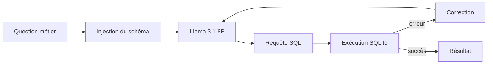

# Agent Text-to-SQL

Agent qui traduit des questions en langage métier en requêtes SQL, avec injection dynamique du schéma et boucle d'auto-correction sur les erreurs SQL. *Projet personnel en cours.*

## Fonctionnement



## Exemple

**Question :** « Quels sont les 3 clients avec les plus gros montants d'abonnements au sein de chaque région ? »

**Requête SQL générée :**

```sql
WITH Ranked AS (
    SELECT T3.region, T1.client_id,
           SUM(T1.prix_mensuel) AS total_abonnement,
           ROW_NUMBER() OVER (PARTITION BY T3.region
                              ORDER BY SUM(T1.prix_mensuel) DESC) AS rn
    FROM abonnements T1
    JOIN clients T2 ON T1.client_id = T2.client_id
    JOIN clients T3 ON T1.client_id = T3.client_id
    GROUP BY T3.region, T1.client_id
)
SELECT T2.nom_entreprise, T3.region, T1.total_abonnement
FROM Ranked T1
JOIN clients T2 ON T1.client_id = T2.client_id
JOIN clients T3 ON T1.client_id = T3.client_id
WHERE T1.rn <= 3;
```

**Résultat (extrait) :**

| Région | Client | Montant d'abonnement |
|---|---|---|
| Alsace | Collet S.A.R.L. | 537,79 € |
| Alsace | Hoareau | 500,67 € |
| Alsace | Rodriguez | 494,51 € |
| Aquitaine | Brunel Lenoir SARL | 593,80 € |
| Aquitaine | Jacob Aubry S.A. | 544,04 € |
| Aquitaine | Dubois SARL | 503,70 € |

*Base de démonstration avec des données fictives.*

## Exemple d'auto-correction

**Tentative 1** : l'agent génère une requête qui échoue :

```sql
WITH Ranked AS (
    SELECT region, client_id,
           SUM(prix_mensuel) AS total_abonnement,
           ROW_NUMBER() OVER (PARTITION BY region
                              ORDER BY SUM(prix_mensuel) DESC) AS rn
    FROM abonnements
    GROUP BY region, client_id
)
SELECT nom_entreprise, region, total_abonnement
FROM Ranked
JOIN clients ON Ranked.client_id = clients.client_id
WHERE rn <= 3;
```

**Erreur SQLite renvoyée à l'agent :**

```
sqlite3.OperationalError: no such column: region
```

**Tentative 2** : la colonne `region` appartient à la table `clients`, pas à `abonnements`. L'agent corrige en ajoutant la jointure nécessaire, et la requête s'exécute avec succès (voir la requête de l'exemple ci-dessus).

## Avancement

- [x] Agent LangChain/LCEL (Llama 3.1 8B)
- [x] Injection dynamique du schéma
- [x] Boucle d'auto-correction
- [ ] Évaluation (précision d'exécution)
- [ ] Fine-tuning QLoRA
- [ ] Serving vLLM et suivi des performances


## Stack

Python · Llama 3.1 8B · LangChain (LCEL) · SQLite · Poetry